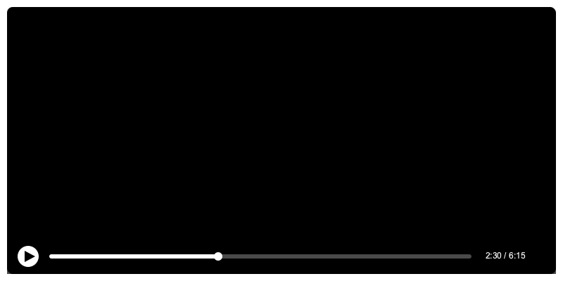

# 在线视频编辑器

一个简单的在线视频编辑器，支持视频剪辑、格式转换和帧率调整。使用 Flask 和 MoviePy 构建，部署在 Render 平台上。

## 功能特点

- 支持上传视频文件（MP4、AVI、MOV、MKV）
- 在线预览视频
- 设置视频剪辑起止时间
- 支持多种输出格式（MP4、AVI、MOV、GIF）
- 支持自定义输出帧率
- 在线处理和下载
 
## 操作界面

### 1. 上传区域

- 支持拖拽上传或点击选择文件
- 显示支持的文件格式
- 实时显示上传进度

### 2. 视频预览

- 视频播放器支持暂停、播放、进度调整
- 显示当前播放时间
- 可以通过播放器直观地选择剪辑点

### 3. 控制面板

#### 时间控制
- 开始时间：设置视频剪辑的起始点
- 结束时间：设置视频剪辑的结束点
- "设为当前"按钮：快速将播放器当前时间设为起始/结束点

#### 输出设置
- 格式选择：支持多种输出格式
  - MP4：通用视频格式
  - GIF：适合短视频和动画
  - AVI：兼容性好
  - MOV：适合 Mac 用户
- 帧率选择：
  - 原始帧率：保持视频原有帧率
  - 60 FPS：流畅度最高
  - 30 FPS：平衡性能和质量
  - 24 FPS：电影级帧率
  - 15 FPS：适合 GIF 动画

### 4. 处理进度

- 显示处理状态和进度
- 处理完成后自动下载
- 错误提示和状态反馈

## 使用流程

1. **上传视频**
   - 将视频文件拖入上传区域或点击选择文件
   - 等待上传完成，查看上传进度

2. **预览和编辑**
   - 使用视频播放器预览内容
   - 播放到合适位置时，点击"设为当前"按钮标记起止时间
   - 也可以直接输入具体的时间点

3. **设置输出**
   - 选择需要的输出格式
   - 选择合适的输出帧率
   - 对于 GIF 格式，建议使用较低帧率（如 15 FPS）以减小文件大小

4. **处理和下载**
   - 点击"处理视频"按钮
   - 等待处理完成
   - 文件会自动下载到本地

## 技术栈

- 后端：Flask + MoviePy
- 前端：Bootstrap + 原生 JavaScript
- 容器化：Docker
- 部署平台：Render

## 本地开发

1. 克隆仓库：
```bash
git clone https://github.com/zl0070047/video-editor-docker-online.git
cd video-editor-docker-online
```

2. 安装依赖：
```bash
pip install -r requirements.txt
```

3. 运行应用：
```bash
python app.py
```

## Docker 部署

```bash
docker-compose up -d
```

## 注意事项

- 上传文件大小限制为 16MB
- 支持的视频格式：MP4、AVI、MOV、MKV
- 支持的输出格式：MP4、AVI、MOV、GIF
- GIF 输出建议使用较低帧率以减小文件大小
- 处理大文件时可能需要较长时间，请耐心等待

## License

MIT License

## Contributing

欢迎提交 Pull Request 来改进这个项目！ 
